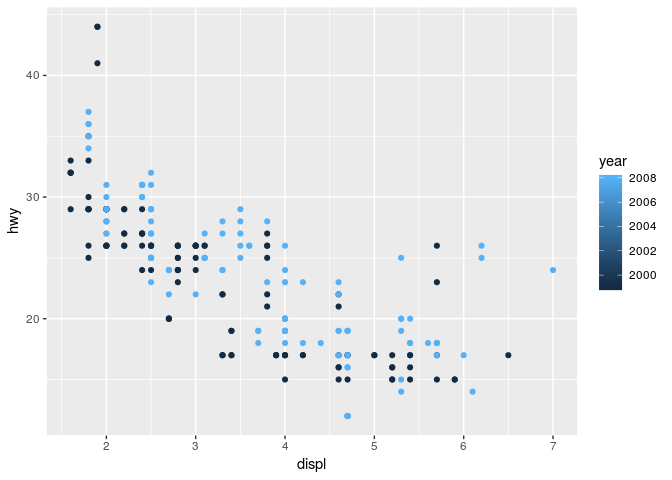
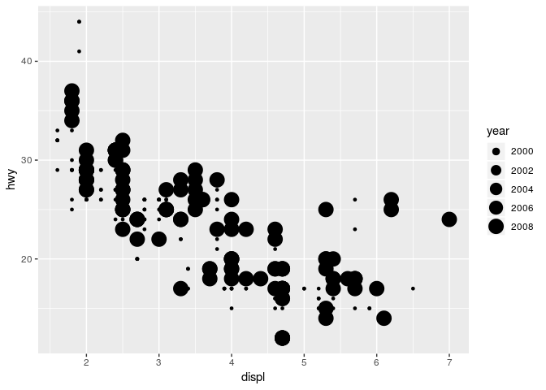
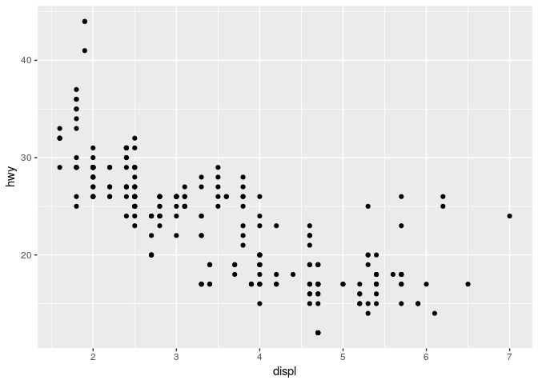
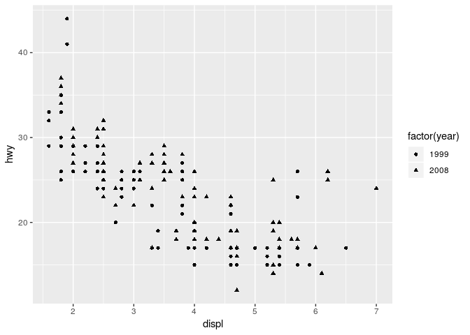
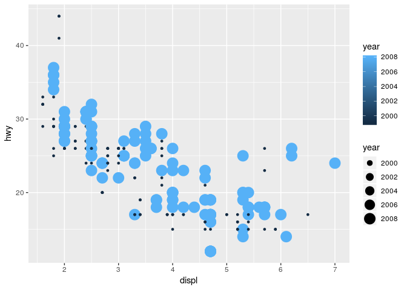
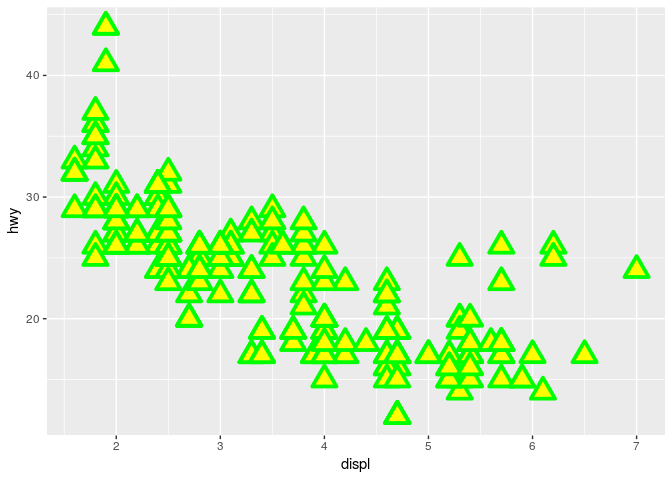

Homework 1: ggplot2
================
Kaisa Roots
2019-03-11

``` r
library(ggplot2)
```

By using *mpg* dataset:

1.  Map a continuous variable to color, size, and shape. How do these
    aesthetics behave differently for categorical vs. continuous
    variables?

For continous variables, a gradient is shown in the legend section,
however, only 2 variables are shown in the graph. Shape aesthetics can
not be used for continous variables, however, shape can be mapped from a
variable using *factor*. This shows that the year continous variable
indeed consists of two variables - 1999 marked with a dot and 2008
marked with a triangle.

  - Color

<!-- end list -->

``` r
ggplot(data = mpg) +
  geom_point(mapping = aes(x = displ , y = hwy, color = year))
```

<!-- -->

  - Size

<!-- end list -->

``` r
ggplot(data = mpg) +
  geom_point(mapping = aes(x = displ , y = hwy, size = year))
```

<!-- -->

  - Shape

A continuous variable can not be mapped to shape

``` r
ggplot(data = mpg) +
  geom_point(mapping = aes(x = displ , y = hwy))
```

<!-- -->

  - Shape with factor

<!-- end list -->

``` r
ggplot(data = mpg) +
  geom_point(mapping = aes(x = displ , y = hwy, shape = factor(year)))
```

<!-- -->

2.  What happens if you map the same variable to multiple aesthetics?

<!-- end list -->

``` r
ggplot(data = mpg) +
  geom_point(mapping = aes(x = displ , y = hwy, color = year, size = year))
```

<!-- -->

3.  What does the stroke aesthetic do? What shapes does it work with?
    (Hint: use ?geom\_point)

Stroke aesthetic can only be used for shapes that have a border (like
21, 24).

``` r
ggplot(data = mpg) +
  geom_point(mapping = aes(x = displ , y = hwy), shape = 24, color = "green" , fill = "#FFFF00", size = 5, stroke = 2)
```

<!-- -->

4.  What happens if you map an aesthetic to something other than a
    variable name, like aes(colour = displ \< 5)?

In this case, car displacement values below 5 are shown in a different
colour.

``` r
ggplot(data = mpg) +
  geom_point(mapping = aes(x = displ , y = hwy, colour = displ < 5))
```

<!-- -->
